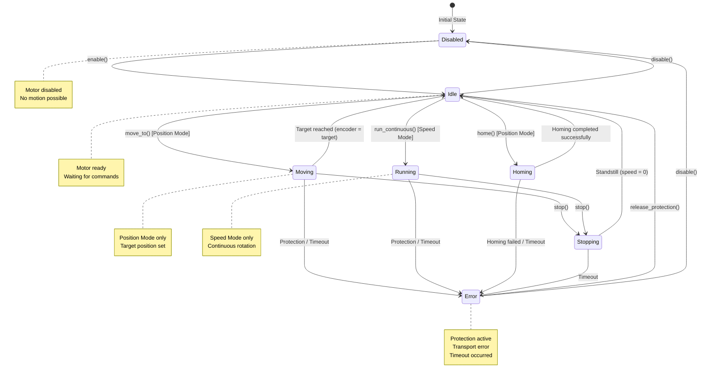

# Layer 2: Movement Logic (StepperEngine) - Detailed Specification

**Parent Document:** [02-cpp-interface.md](./02-cpp-interface.md)  
**Status:** 🔵 SPECIFICATION – Layer 2 implementation details

**Navigation:**
- [← Previous: Layer 1 (ServoXxd)](./02a-layer1-core.md)
- [← Back to Overview](./02-cpp-interface.md#layer-2-movement-logic-transport-agnostic)
- [→ Next: Layer 3 (CommandQueue)](./02c-layer3-command-queue.md)

---

## Overview

**Class:** StepperEngine

**Design Pattern:** State Machine + Strategy

**Role in Architecture:**
- Core movement and state machine logic
- Coordinates between ServoXxd (Layer 1) and CommandQueue (Layer 3)
- Transport-agnostic (works with any transport layer)
- Manages all movement, homing, and error handling

## Responsibilities

- Encapsulates all movement, homing, and stop logic as state machine
- Processes all movement commands (move_to, stop, home, run_continuous)
- Monitors and controls internal states (Idle, Moving, Homing, Error, Disabled...)
- Manages CommandQueue (Layer 3) and processes transport callbacks (response, error, timeout)
- Communicates with ServoXxd parent (Layer 1) for configuration, status, helper functions
- Manages and regularly updates values like encoder position (current_position) using hybrid strategy (polling + event)

## Update Strategy for Status Values

StepperEngine manages regular polling and updates of multiple status values from the motor controller using a hybrid strategy (polling + event-triggered queries).

**Polled Status Values** (default interval: 100–500ms):

1. **Encoder Position** (Command 0x30) - Split format, primary source for current_position tracking
2. **Motor Speed** (Command 0x32) - Real-time RPM, used for state transitions
3. **Motor Status** (Command 0x3A) - Enabled/disabled state, monitors sleep_when_done
4. **Protection Status** (Command 0x3E) - Locked-rotor protection, triggers Error state

**Optionally Polled Values:**
- IO Ports Status (0x34), Angle Error (0x39), Pulse Count (0x33), Homing Status (0x3B)

**Event-Triggered Queries:**
- After move_to(), stop(), home(), enable()/disable(), error recovery

**Polling Strategy Requirements:**
1. Configurable poll interval (default: 200ms)
2. update() method checks timing, executes state machine, processes timeouts
3. Millisecond precision timing with overflow handling

**Error Detection:**
- Timeouts → Error state
- Protection status != 0 → Error state, log cause
- Communication errors → retry with exponential backoff

> For full details, see the [main specification](./02-cpp-interface.md#update-strategy-for-status-values).

## Public Methods

```cpp
void move_to(Position target, std::optional<Speed> speed, std::optional<Acceleration> accel);
void stop(std::optional<Acceleration> decel);
void emergency_stop();
void home();  // Uses homing configuration from ServoXxd parent
void run_continuous(std::optional<Speed> speed, std::optional<Acceleration> accel);
void update(); // called cyclically, processes state machine, CommandQueue, and polling
Position get_current_position() const;
void set_position_update_callback(std::function<void(Position)> cb);
void handle_error(...);
void on_transport_response(Command cmd, const std::vector<uint8_t>& data);
void on_transport_error(Command cmd, ErrorCode error);
```

> Note: `move_to` accepts optional `speed`/`accel` overrides for atomar parametrierte Bewegungen. Wenn sie weggelassen werden, nutzt der Engine die zuletzt gesetzten Werte bzw. Defaults. `run_continuous` akzeptiert ebenfalls optionale Parameter; weggelassene Werte behalten den vorherigen Zustand.

## State Machine

**States:**

```cpp
enum class State {
  Disabled,      // Motor disabled, no motion possible
  Idle,          // Motor ready, waiting for commands
  Moving,        // Position movement in progress (Position Mode only)
  Running,       // Continuous rotation in progress (Speed Mode only)
  Homing,        // Homing process in progress
  Stopping,      // Controlled stop in progress (with deceleration)
  Error          // Error occurred (e.g. Protection, Transport error, Timeout)
};
```

### State Diagram



**Special Transitions:**
- `emergency_stop()`: Can be called from **any state** → immediately transitions to `Error` state, bypasses CommandQueue, halts motor
- State transitions are validated before execution (see Command Validation Matrix below)

### State Transitions

| From → To | Trigger | Condition | Action |
|-----------|---------|-----------|--------|
| Disabled → Idle | enable() | - | Enable motor, query status |
| Idle → Disabled | disable() | - | Disable motor |
| Idle → Moving | move_to() | Position Mode | Send move command, set target |
| Idle → Running | run_continuous() | Speed Mode | Send speed command |
| Idle → Homing | home() | Position Mode | Start homing sequence |
| Moving → Idle | Target reached | Encoder = target | - |
| Moving → Stopping | stop() | - | Send stop with decel |
| Running → Stopping | stop() | - | Send stop with decel |
| Homing → Idle | Completed | Homing status OK | Set position offset |
| Stopping → Idle | Standstill | Speed = 0 | - |
| * → Error | Protection | Protection != 0 | Log, stop motor |
| * → Error | Timeout | No response | Log, retry/abort |
| * → Error | emergency_stop() | - | Halt, disable, set flag |
| Error → Idle | release_protection() | - | Reset flag, check status |

### Events and Processing

- **Commands from Layer 1:** move_to(), home(), stop(), run_continuous(), enable(), disable(), emergency_stop()
- **StepperEngine (Layer 2):** Processes commands, manages state machine, encodes data via CommandDecoder, decides transport commands
- **CommandQueue (Layer 3):** Serializes execution, manages timeouts
- **Transport Responses (Layer 4):** Raw response bytes processed by Layer 2 using CommandDecoder decoders
- **Polling Events:** Regular queries trigger transitions (e.g. Moving → Idle when target reached)
- **Error Events:** Protection, timeout, transport errors trigger Error state

### State Machine Responsibilities

- Validate commands based on current state
- Automatic transitions based on encoder feedback and status updates
- Error handling and recovery
- Enqueue transport commands via CommandQueue (Layer 3) with proper validation
- Process responses from transport layer (Layer 4) and update internal state

**Implementation Notes:**
- update() processes state transitions based on internal events
- Log state transitions for debugging
- Monitor state-specific timeouts
- Invalid commands: log error, ignore

## Command Validation Matrix

> See [full matrix in main specification](./02-cpp-interface.md#command-validation-matrix)

**Legend:**
- ✅ = Allowed (immediate execution)
- ❌ = Rejected (ignored, logged)
- ⏸️ = Buffered (queued for later)
- 🔄 = Replace (override current operation)

**Key Rules:**
- enable() only in Disabled state
- move_to()/home() require Position Mode + Idle/Moving/Stopping state
- run_continuous() requires Speed Mode
- emergency_stop() always allowed
- Some commands buffer during motion, applied when reaching Idle

**Target Override Behavior:**
When move_to() called during Moving/Stopping, two strategies:
1. **Immediate Update** - Hardware supports mid-movement updates (preferred)
2. **Coalescing Buffer** - Hardware doesn't support, buffer newest target only

Developer must test hardware and implement one strategy permanently.

## Runtime State Members

**Architectural Decision:** StepperEngine (Layer 2) owns all movement-related runtime state.
Layer 1 (ServoXxd) is a Facade and delegates state queries to the engine.

```cpp
// Core state
ServoXxd* parent_;              // Parent component (configuration, helpers)
CommandQueue* queue_;           // Command queue for serial execution
State state_;                   // Current state machine state
bool emergency_flag_;           // Emergency stop flag (cleared by release_protection)

// Status tracking (from hardware polling)
Speed current_speed_;           // Last known motor speed from hardware (RPM)
bool protection_triggered_;     // Protection status (locked-rotor, etc.)

// State timing
uint32_t state_enter_time_;     // State entry timestamp for timeout tracking

// Buffered commands
bool disable_pending_;          // Disable command deferred (execute after stop)
```

**Note:** Position tracking (`current_pos_`, `target_pos_`) remains in Layer 1 for ESPHome base class compatibility (`stepper::Stepper::current_position`, `target_position`).

## Interface to ServoXxd (Layer 1)

- Constructor: `StepperEngine(ServoXxd* parent, ...)`
- Access configuration, status, helpers via parent pointer
- Optional callbacks for status changes

### Example Flow (Layer 1 → Layer 2)

```
ServoXxd::set_target()     → engine_->move_to(...)
ServoXxd::home()           → engine_->home(...)
ServoXxd::stop()           → engine_->stop(...)
ServoXxd::run_continuous() → engine_->run_continuous(...)
ServoXxd::loop()           → engine_->update()
```

## CommandQueue Integration

- StepperEngine holds and manages the CommandQueue instance
- `update()` calls `queue->execute_next()`, checks timeouts, processes responses/errors
- Transport callbacks delegated to `engine->on_transport_response()` / `on_transport_error()`
- Layer 2 uses `CommandDecoder` to encode movement parameters before passing to transport
- Layer 2 uses `CommandDecoder` to decode responses from transport (encoder, speed, status, etc.)

## Benefits

- Improved testability and extensibility
- Facade (Layer 1) remains clean and simple
- Movement logic clearly encapsulated and independently developable
- Current position always up-to-date and robust against communication errors

---

**Navigation:**
- [← Previous: Layer 1 (ServoXxd)](./02a-layer1-core.md)
- [← Back to Overview](./02-cpp-interface.md#layer-2-movement-logic-transport-agnostic)
- [→ Next: Layer 3 (CommandQueue)](./02c-layer3-command-queue.md)
